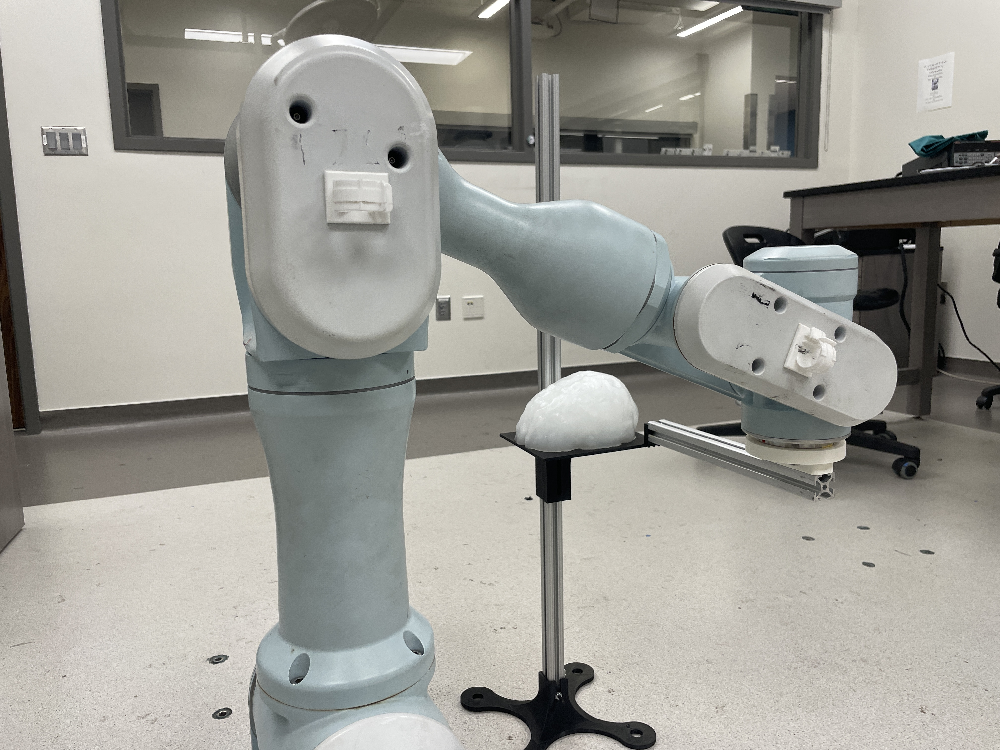
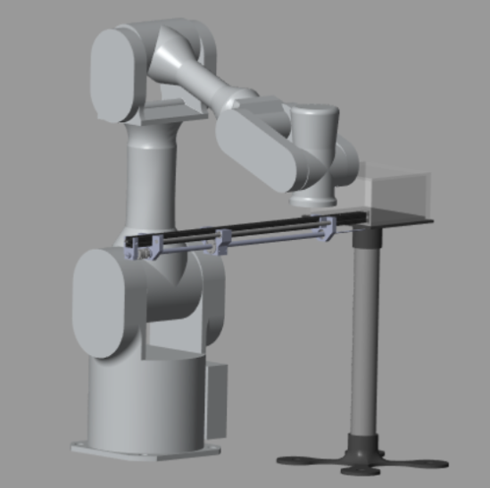
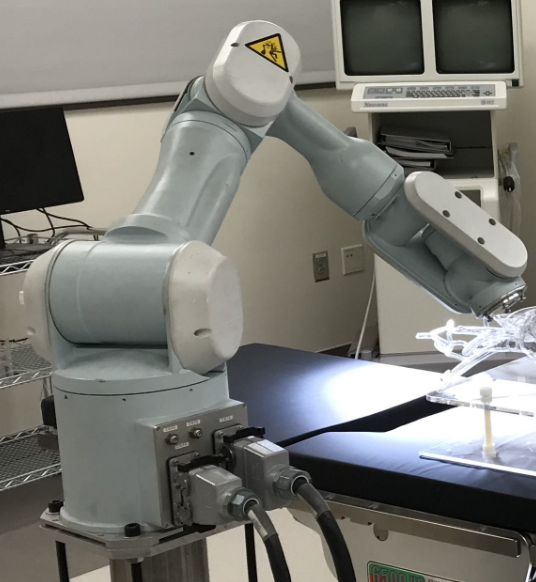

# 6-DOF Surgical Arm Kinematics

## Details

- MATLAB-based inverse kinematics planning with collision avoidance
- Analyzed joint trajectories and optimized motion efficiency

- Simulated entry paths on hydrogel brain models in real-life

