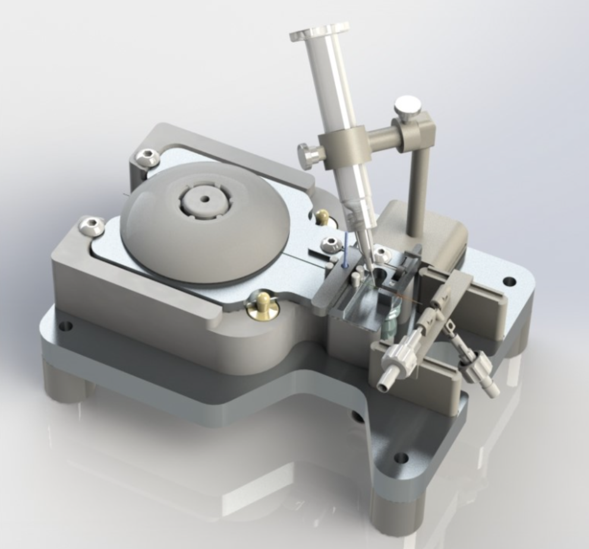

# Boston Scientific Intern Project

## Details

- Designed and machined custom fixtures
- Ran design-of-experiments (DOE) to identify optimal parameters
- Automated workflow to improve throughput by 10× and reduce scrap by 80%