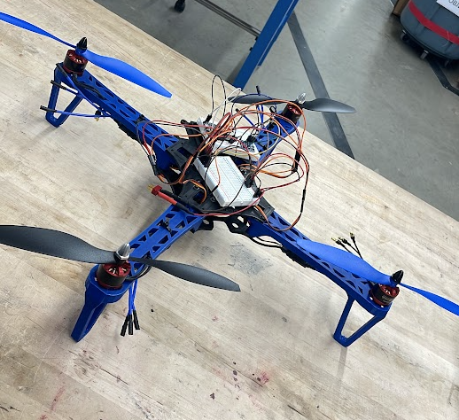

# Custom Drone and Flight Controller

Built a $300 drone with a custom ESP-8266-based flight controller.

## Details

- Designed and 3D-printed structural components
- Developed ESP-8266 firmware for flight control
- Implemented object-tracking for autonomous flight and landing
- Achieved stable autonomous operation with cost-effective hardware.