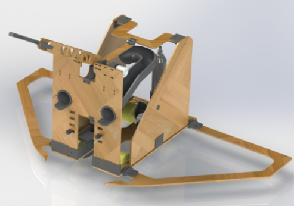

# ME 2110 Robot

Built a task-performing robot for Georgia Tech’s ME 2110 course.

## Details

- 3D-printed and laser-cut structural components
- Autonomous operation programmed in Arduino IDE
- Passive actuators for task-specific mechanisms