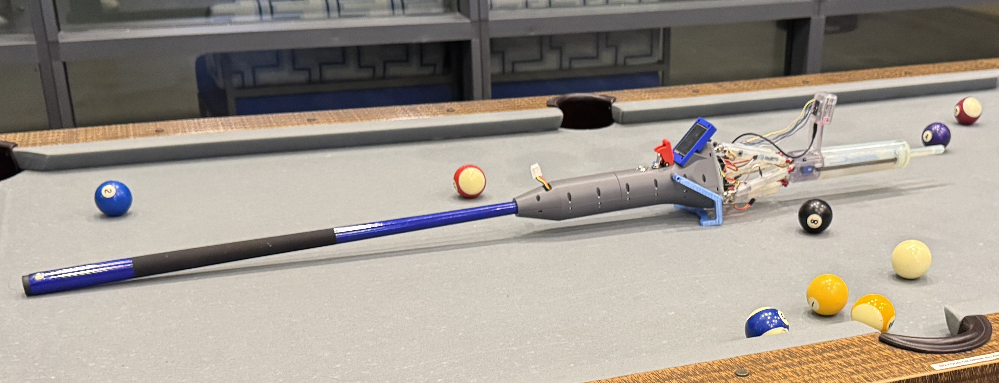
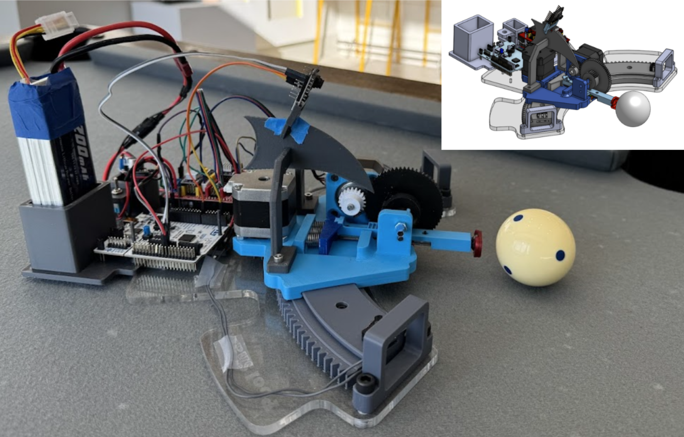
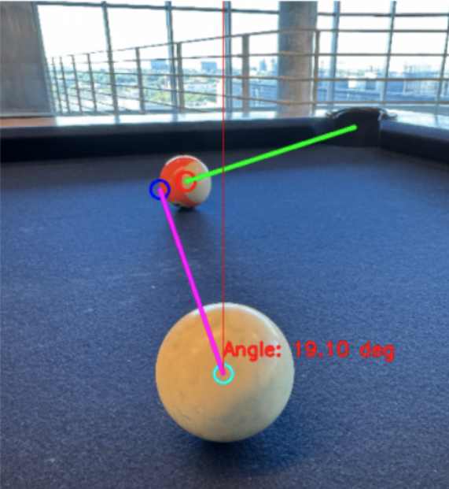

# Pool Shooting Robot

## Details

- Custom 3D-printed curved rail and rack-and-pinion system
- Spring-based shooting mechanism delivering 100 N force
- ESP-32 camera for image capture
- YOLOv11 model trained on 500 labeled images for shot angle detection (99% accuracy)
- V2 in development: self-contained pool stick with Stewart platform and CAM-driven shot

