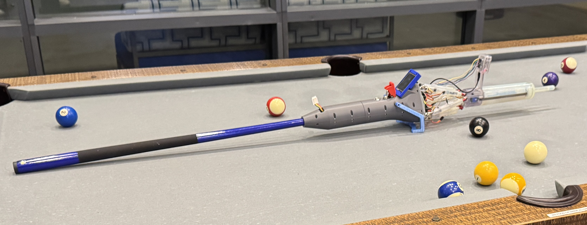
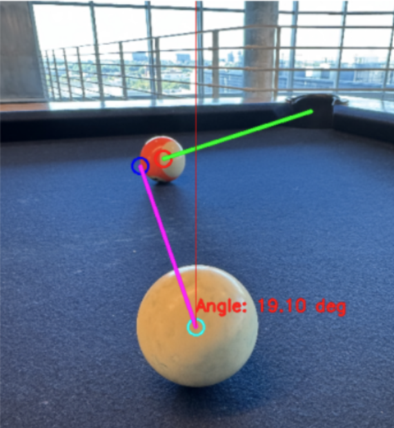
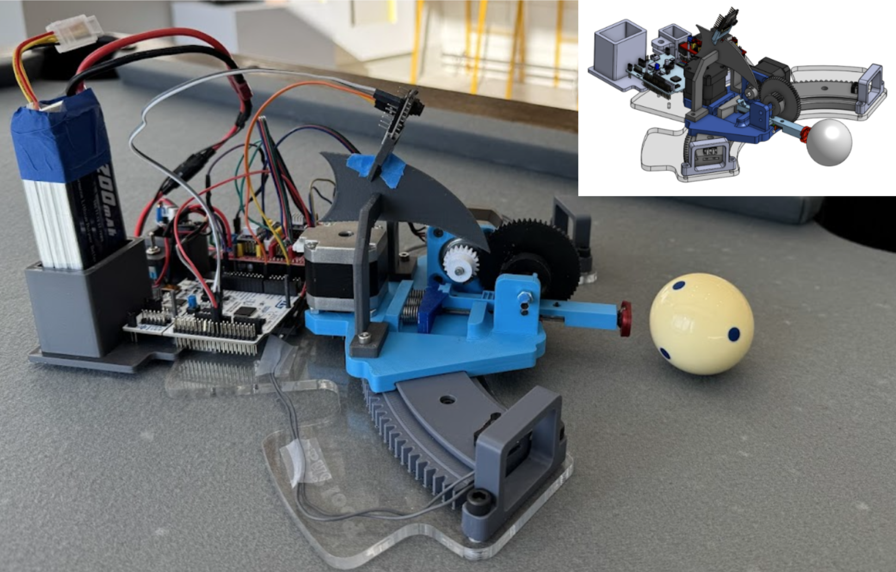

# Pool Shooting Robot

## Details

- Self=contained on a standard pool cue
- Battery powered and controlled with an ESP-32
- Uses computer vision and a control loop to auto align shots
- 6-DOF linear stewart platform for adjustment
- Adjustable spring-based shooting mechanism delivering 100+ N force

- YOLOv11 model trained on 500 labeled images for shot angle detection (99% accuracy)

- Version 1 of the design was a tabletop version that was placed behind the ball
- Had a custom 3D-printed curved rail and rack-and-pinion system

