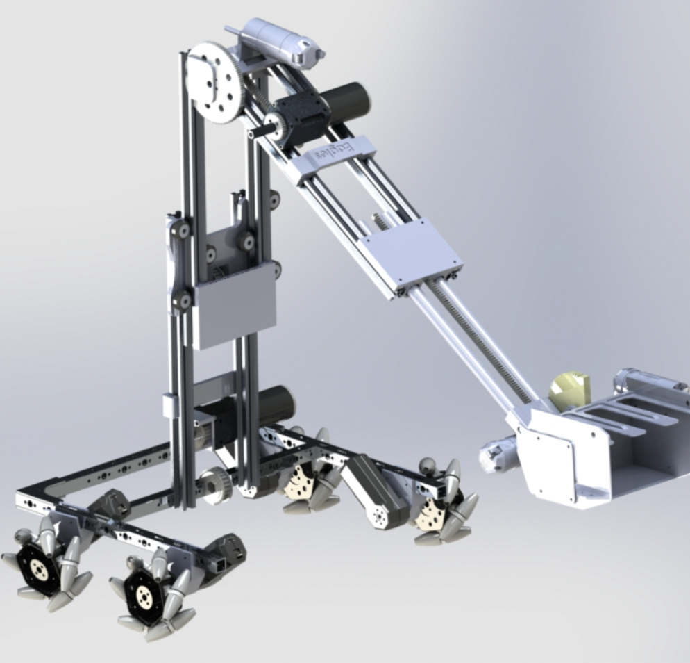
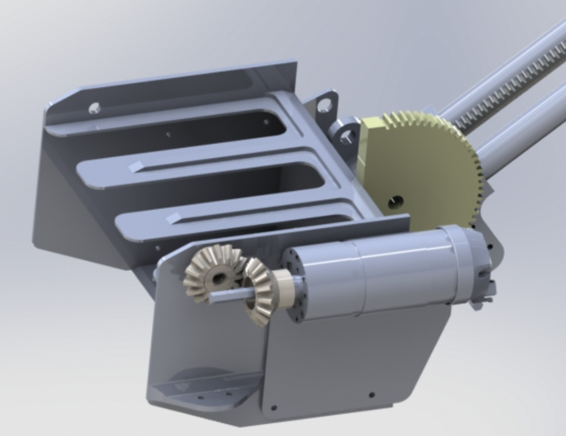

# Robotics Season: 2018-2019 (FTC - Rover Ruckus)

Built and designed a multi-object intake for FTC robot using SolidWorks and 3D printing.

## Details

- CAD modeled intake mechanism in SolidWorks
- Prototyped components with 3D printing
- Optimized for high-throughput object collection and scoring

