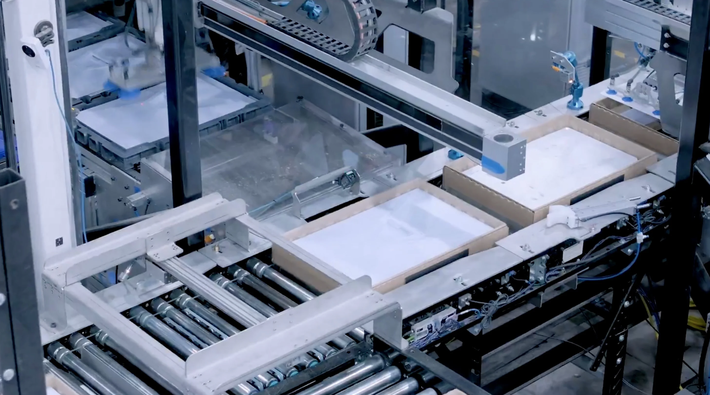
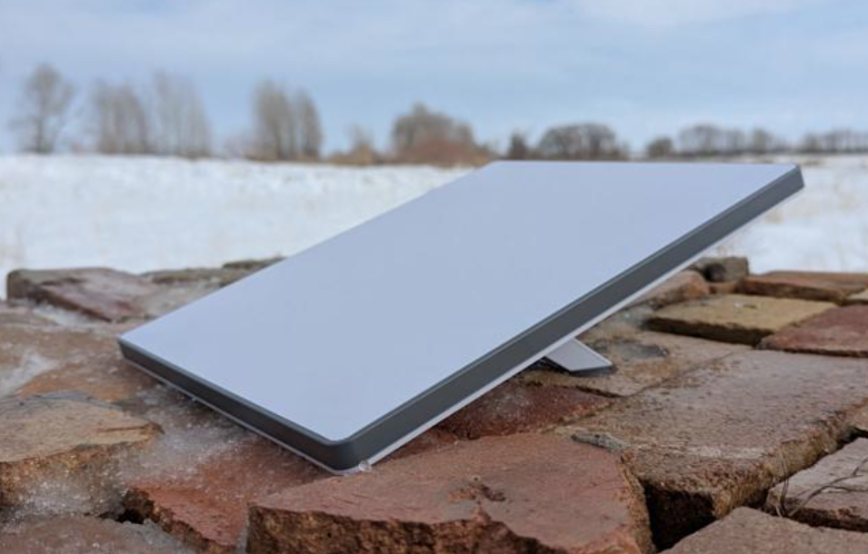

# SpaceX Intern Project

## Details

- Dish flipping and rotation using 4 pneumatic actuators
- High-speed YZ gantry with vacuum end effector
- Achieved 2000 units/hour throughput with zero failures in 50k cycles after two design iterations

