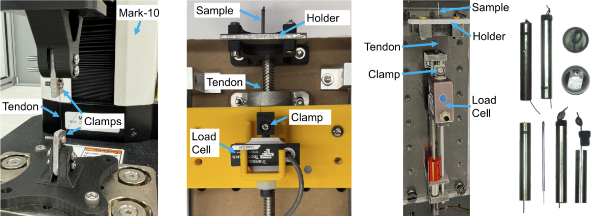

# Tendon Driven Guidewires

## Details

- Explored knots, epoxy bonds, and laser-cut micro plates for tendon attachment
- Conducted over 60 pull tests achieving 2× required pulling force
- Integrated methods into endoscopic robot prototypes

## Publication

[Tutorial paper](https://link.springer.com/article/10.1007/s41745-024-00455-3)