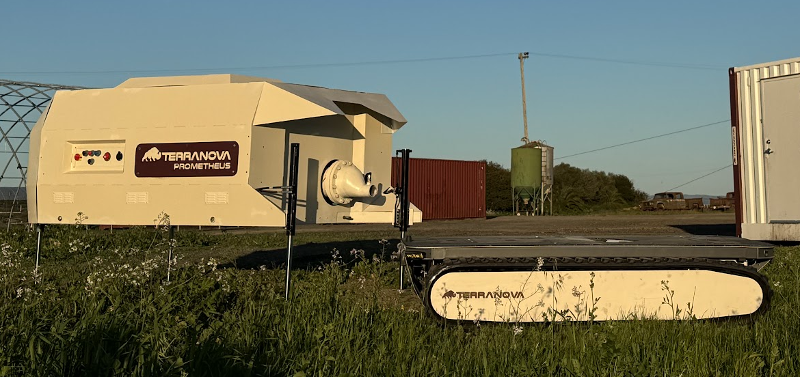

# Rover Program at Terranova

## Details

- Developing mechanical systems and robotic platforms to create new habitable land, restore degraded habitats, and protect coastlines and critical infrastructure from flooding at scale ([terranova.inc](https://terranova.inc))
- Designed two full construction-sized robotic rover systems from scratch (Atlas and Prometheus)
- Atlas is a low-profile all-terrain robotic platform capable of carrying various payloads up to 3 tons with a 12 hr battery life and remotely controllable
- Prometheus is a large pumping unit that is capable of delivering our land-lifting wood chip slurry at rates up to 400 gallons per minute
- Working closely with forward-deployed engineering teams and business development to advance and expand operational deployments

