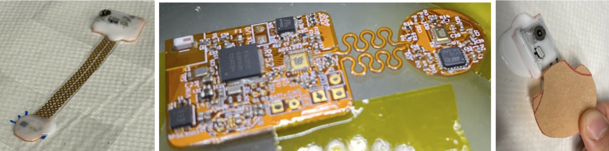

# Wearable Stethoscope

## Details

- Fabricated 10 nano-devices for acoustic sensing
- Collected cardiac and pulmonary sound data
- Applied MATLAB signal processing to isolate biomarkers for COPD and CVD detection