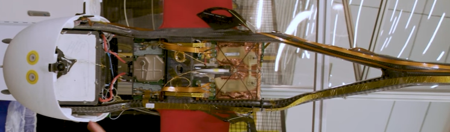

# Zipline Intern Project

## Details

- Designed 18 injection-molded parts for busbars and electronics
- Developed 5 assembly fixtures
- Used NX CAD, Python, Mark-10 testing, laser cutting, and 3D printing
- Optimized designs for flight, thermal, and safety requirements